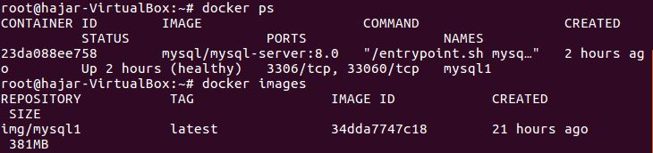

## Anleitung für Docker mit MySql-Server erstellen

```
*-----------------------------------------------------------------------*
| Notebook                                 Homenetz: 192.168.1.0/24     |                      
| Virtelle Umgebung: Virtualbox 6.1.2      IP-Adresse: 10.0.2.15/24     |
*-----------------------------------------------------------------------*	

*---------------------------------------*                
|Datenbank: MySql Server                |
|Container                              |
|Container-Engine: Docker               |
|Gast OS: Ubuntu 16.04                  |
|Hypervisor: VBox                       |
|Host-OS: Windows 10                    |
*---------------------------------------*	
```
##### Docker erstellen
- Der Docker vom https://hub.docker.com/r/mysql/mysql-server auf dem VM pullen.
```
docker pull mysql/mysql-server:8.0
```
- Das Image, welche auf dem Server gespeicher ist, laufen lassen.
```
docker run --name my-own-mysql -e MYSQL_ROOT_PASSWORD=mypass123 -d mysql:8.0.1 #--name: Imagesname, Rootpassword, -d: Docker im Hintergrund laufen lassen, mysql: Version
```
- Nun ist der Docker erstellt. Wir können das **image** und **Docker** kontrollieren.
```
docker images #Die vorhandene Docker images werden angezeigt
docker ps     #Die laufende Dockers werden angezeigt
```


- Das Root Password random generieren 
```
docker logs mysql1
```
- Das Password kontrollieren
```
docker logs mysql1 2>&1 | grep GENERATED
```
- Mit dem User Root auf dem MySql DB zugreifen und das generierte Passwort eingeben.
```
docker exec -it mysql1 mysql -uroot -p
```


| Server              | Hostname            | IP-Adresse          | Netz                | Port                |
|:--------------------|:--------------------|:--------------------|:--------------------|:--------------------|
| Web-Server: apache2 | lb2web              | 192.168.2.201       | NAT: 80             | 8080                |
| DB-Server: mysql    | lb2db               | 192.168.2.200       | __                  | 3306                |

<p> URL: http://localhost:8080/adminer.php <br>
 
**LOGIN-ANGABE:**  `Username: User` `Password: admin`


- **Vagrantfile**, **Readme.md** , **Fotos**, **.gitignore** und **db.sh** auf dem Github-Repository pushen.

`Test`
- [x] Beim Aufruf der URL wird der Adminer.php loginseite angezeigt.
- [x] **Vagrantfile**, **Readme.md**, **Fotos**, **.gitignore** und **db.sh** erfolgreich auf dem Github-Repository gepusht.

##### Zurück zur Haupt-Dokumentation: https://github.com/hajhos/m300lb3
